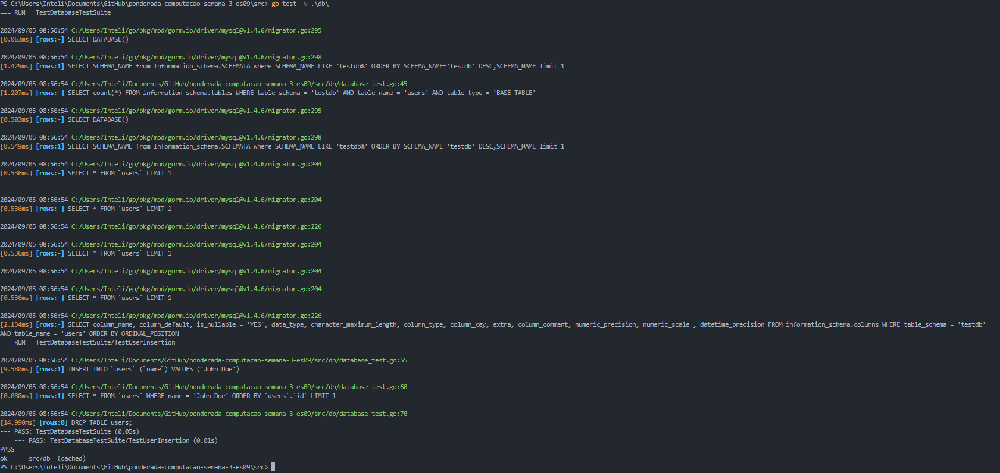
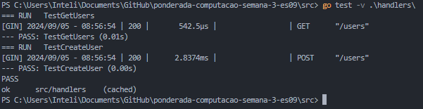

# **Implementação de Testes Unitários com Gin, GORM e PostgreSQL em Go**

## **Apresentação da Atividade**

Este repositório contém a implementação de testes unitários para um projeto Go utilizando o framework Gin, o ORM GORM e o banco de dados MySQL (simulando PostgreSQL). A atividade está baseada no artigo *"Effective Unit Testing in Golang and Gin based projects"*, com a aplicação de boas práticas de Desenvolvimento Guiado por Testes (TDD).

### **Atividades Realizadas**

1. **Criação do Repositório GitHub**: O código-fonte dos testes unitários foi organizado neste repositório.
   
2. **Execução e Documentação dos Testes**: Todos os testes foram executados com sucesso e prints foram gerados para registrar os resultados obtidos.

3. **Expansão dos Comentários**: Comentários explicativos foram adicionados ao código para descrever as técnicas de TDD utilizadas e a lógica por trás dos testes.

### **Tecnologias Utilizadas**

- **Linguagem**: Go
- **Framework**: Gin
- **ORM**: GORM
- **Banco de Dados**: MySQL (pode ser adaptado para PostgreSQL)
- **Biblioteca de Testes**: Testify

---

## **Registros das Execuções Bem-sucedidas dos Testes**

Abaixo estão os prints das execuções bem-sucedidas dos testes realizados, documentando que todos os testes passaram corretamente:

### Teste 1: Inserção de Usuário no Banco de Dados

Este teste valida a inserção de um novo usuário no banco de dados utilizando GORM.

---

### Teste 2: Recuperação de Usuários via Handler HTTP

Este teste valida a funcionalidade do endpoint `GET /users`, verificando se a resposta HTTP retorna os usuários corretamente.

### Teste 3: Criação de Usuário via Handler HTTP

Este teste verifica o endpoint `POST /users`, certificando-se de que um usuário é criado corretamente a partir de uma requisição HTTP.

---

## **Objetivo**

O objetivo desta atividade foi implementar e validar testes unitários eficazes em um projeto Go, garantindo a robustez e qualidade do código através de práticas de TDD. Os testes foram organizados para validar tanto a lógica de banco de dados quanto a camada de API utilizando o Gin.